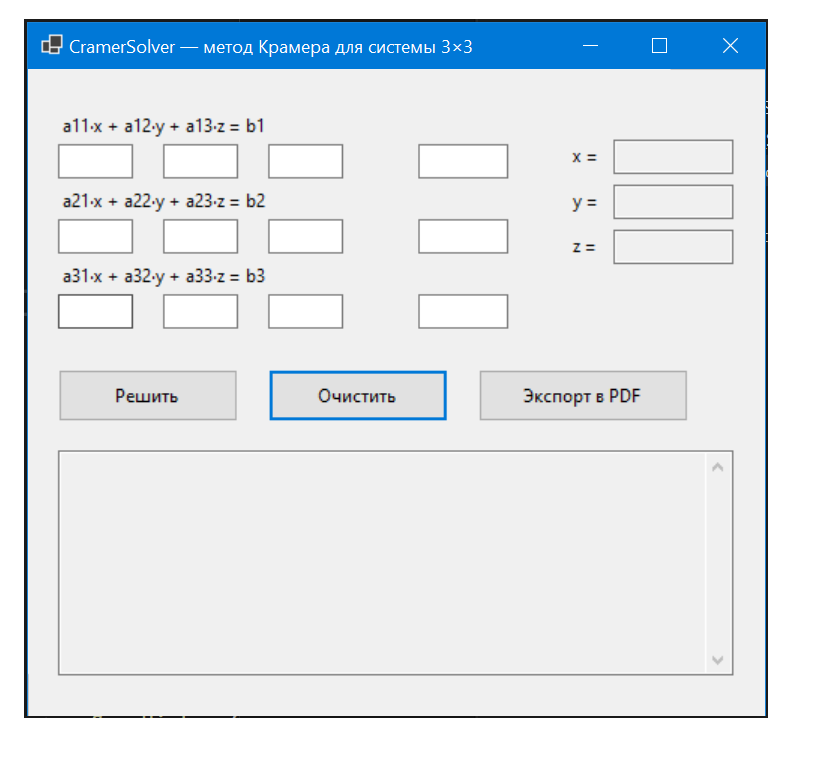
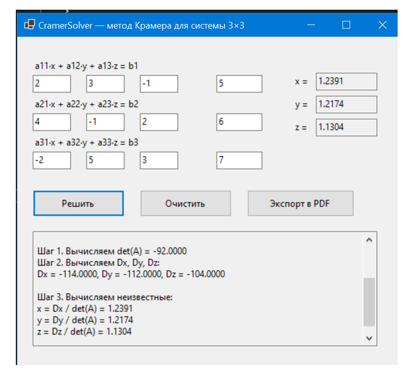

# CramerSolver  
WinForms-приложение для решения системы линейных уравнений 3×3 методом Крамера.

##  Интерфейс программы

### Главное окно приложения:


### Пример решенной системы:


## 💡 Возможности программы

- Ввод коэффициентов системы 3×3 (a11…a33 и b1…b3)  
- Проверка корректности ввода  
- Подсветка ошибок (ErrorProvider)  
- Вычисление det(A), Dx, Dy, Dz  
- Определение типа системы:
  - единственное решение;
  - бесконечно много решений;
  - система несовместна.  
- Пошаговое объяснение решения  
- Автоматическое сохранение истории (`history.txt`)  
- Экспорт результата и шагов в PDF  
- Очистка всех полей одной кнопкой  

## 🧮 Алгоритм (фрагмент кода)

```csharp
private double Det3(double[,] m)
{
    double a11 = m[0, 0], a12 = m[0, 1], a13 = m[0, 2];
    double a21 = m[1, 0], a22 = m[1, 1], a23 = m[1, 2];
    double a31 = m[2, 0], a32 = m[2, 1], a33 = m[2, 2];

    return
        a11 * a22 * a33 +
        a12 * a23 * a31 +
        a13 * a21 * a32 -
        a13 * a22 * a31 -
        a11 * a23 * a32 -
        a12 * a21 * a33;
}
